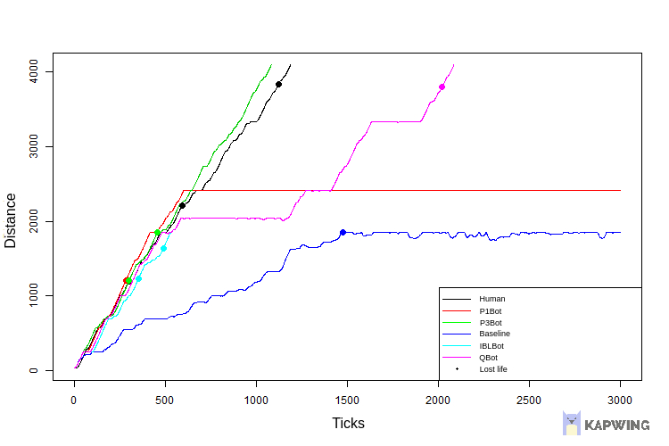

# Mario Bros Agent Competition #

](./imgs/mario.gif)

## Description ##

Machine learning course assignment. Development of multiple agents strategies for Mario Bros game and comparison angainst baseline and human results.

Project code based on the [2009 Mario AI competition](https://ieeexplore.ieee.org/document/5586133).

## Results ##

In total six agents have been compared:
* [Human](project/src/ch/idsia/agents/controllers/P3HumanAgent.java): Agent controlled by a team member.
* [Baseline](project/src/ch/idsia/agents/controllers/BaselineAgent.java): Agent provided by the Mario AI project. It selects actions randomly.
* [P1Bot](project/src/ch/idsia/agents/controllers/P1BotAgent.java): Agent developed for this assignment using decission tree (J48) derived rules.
* [P3Bot](project/src/ch/idsia/agents/controllers/P3BotAgent.java): Agent developed for this assignment using hard coded rules.
* [IBLBot](project/src/ch/idsia/agents/controllers/IBLBotAgent.java): Agent developed for this assignment using instance-based learning.
* [QBot](project/src/ch/idsia/agents/controllers/QBot.java): Agent developed for this assignment using Q-learning reinforcement learning algorithm.

  

<figure>

<figcaption align = "center"><b>Fig.1 - Example of agents performance against baseline agent and human players.</b></figcaption>
</figure>

  

Out of the four agents developed for the assignment, QBot is the best performing angent with the following stats:

Description  | Value
------------- | -------------
Number of levels attempted | 32
Levels won | 56%
Levels lost | 44%
Average progress per level | 64%
